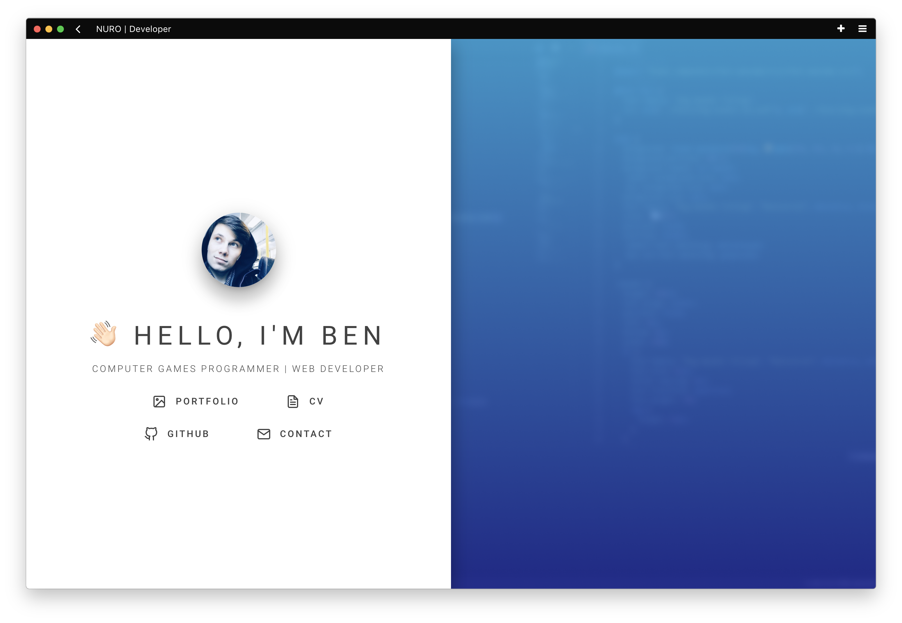

<div align="center">

[](https://nuro.dev) 
[](http://www.gnu.org/licenses/) 
[](https://gitmoji.carloscuesta.me/)

<br />
<br />



</div>

## 🛠 Development

Clone the repository
```shell
$ git clone https://github.com/nurodev/nuro.sh.git
```

Install dependencies using npm or yarn
```shell
$ npm install # yarn install 
```

Start the development server
```shell
$ npm run dev # yarn dev
```

## 📄 License

MIT © [Ben Dixon](https://github.com/nurodev/nuro.sh/blob/master/LICENSE)
